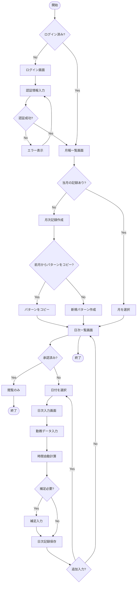
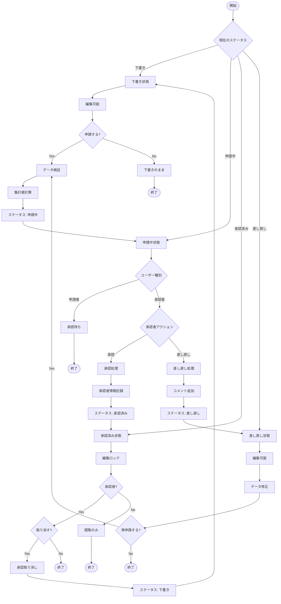
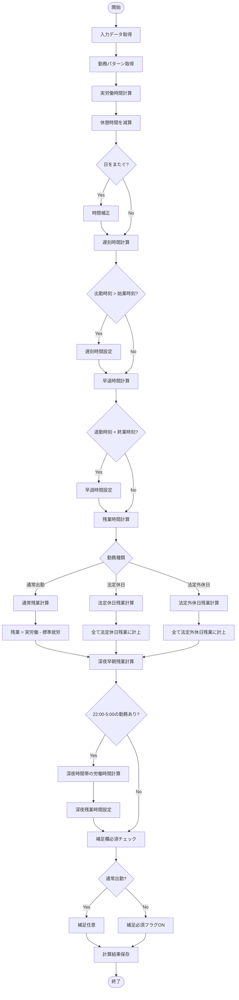
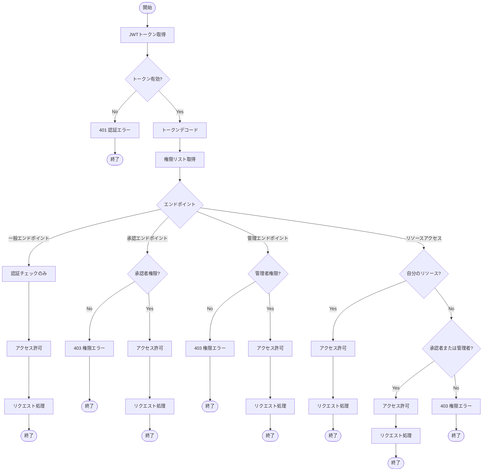
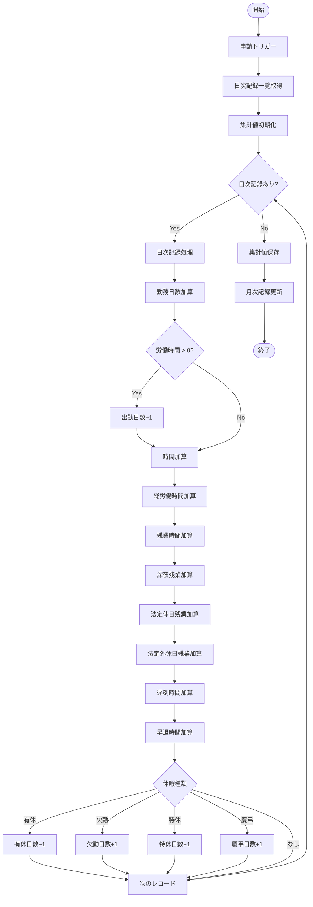

# アクティビティ図

勤務月報システムの主要な業務フローを示します。

## 1. 月次勤務入力フロー

```mermaid
flowchart TD
    Start([開始]) --> Login{ログイン済み?}
    Login -->|No| LoginPage[ログイン画面]
    LoginPage --> InputCredentials[認証情報入力]
    InputCredentials --> Authenticate{認証成功?}
    Authenticate -->|No| ShowError[エラー表示]
    ShowError --> InputCredentials
    Authenticate -->|Yes| MonthlyList

    Login -->|Yes| MonthlyList[月報一覧画面]
    MonthlyList --> HasRecord{当月の記録あり?}
    HasRecord -->|No| CreateMonthly[月次記録作成]
    CreateMonthly --> CopyPattern{前月からパターンをコピー?}
    CopyPattern -->|Yes| CopyPatternAction[パターンをコピー]
    CopyPatternAction --> DailyList
    CopyPattern -->|No| CreatePattern[新規パターン作成]
    CreatePattern --> DailyList
    HasRecord -->|Yes| SelectMonth[月を選択]
    SelectMonth --> DailyList[日次一覧画面]

    DailyList --> CheckLock{承認済み?}
    CheckLock -->|Yes| ViewOnly[閲覧のみ]
    ViewOnly --> EndView([終了])
    CheckLock -->|No| SelectDate[日付を選択]
    SelectDate --> DailyEdit[日次入力画面]
    DailyEdit --> InputWork[勤務データ入力]
    InputWork --> AutoCalc[時間自動計算]
    AutoCalc --> NoteRequired{補足必要?}
    NoteRequired -->|Yes| InputNote[補足入力]
    InputNote --> SaveDaily
    NoteRequired -->|No| SaveDaily[日次記録保存]
    SaveDaily --> MoreInput{追加入力?}
    MoreInput -->|Yes| SelectDate
    MoreInput -->|No| DailyList
    DailyList --> End([終了])
```

## 2. 承認ワークフロー

```mermaid
flowchart TD
    Start([開始]) --> CheckStatus{現在のステータス}
    
    %% 下書き状態
    CheckStatus -->|下書き| DraftState[下書き状態]
    DraftState --> EditAllowed[編集可能]
    EditAllowed --> Submit{申請する?}
    Submit -->|Yes| ValidateData[データ検証]
    ValidateData --> CalcTotals[集計値計算]
    CalcTotals --> ChangeToSubmitted[ステータス: 申請中]
    ChangeToSubmitted --> SubmittedState
    Submit -->|No| StayDraft[下書きのまま]
    StayDraft --> End1([終了])

    %% 申請中状態
    CheckStatus -->|申請中| SubmittedState[申請中状態]
    SubmittedState --> SubmitterView{ユーザー種別}
    SubmitterView -->|申請者| WaitApproval[承認待ち]
    WaitApproval --> End2([終了])
    SubmitterView -->|承認者| ApproverAction{承認者アクション}
    ApproverAction -->|承認| Approve[承認処理]
    Approve --> RecordApprover[承認者情報記録]
    RecordApprover --> ChangeToApproved[ステータス: 承認済み]
    ChangeToApproved --> ApprovedState
    ApproverAction -->|差し戻し| Reject[差し戻し処理]
    Reject --> AddComment[コメント追加]
    AddComment --> ChangeToRejected[ステータス: 差し戻し]
    ChangeToRejected --> RejectedState

    %% 承認済み状態
    CheckStatus -->|承認済み| ApprovedState[承認済み状態]
    ApprovedState --> Locked[編集ロック]
    Locked --> CanRevoke{承認者?}
    CanRevoke -->|Yes| RevokeAction{取り消す?}
    RevokeAction -->|Yes| Revoke[承認取り消し]
    Revoke --> ChangeToDraft[ステータス: 下書き]
    ChangeToDraft --> DraftState
    RevokeAction -->|No| End3([終了])
    CanRevoke -->|No| ViewOnlyApproved[閲覧のみ]
    ViewOnlyApproved --> End4([終了])

    %% 差し戻し状態
    CheckStatus -->|差し戻し| RejectedState[差し戻し状態]
    RejectedState --> CanEdit[編集可能]
    CanEdit --> FixData[データ修正]
    FixData --> ReSubmit{再申請する?}
    ReSubmit -->|Yes| ValidateData
    ReSubmit -->|No| End5([終了])
```

## 3. 勤務時間計算フロー

```mermaid
flowchart TD
    Start([開始]) --> GetInput[入力データ取得]
    GetInput --> GetPattern[勤務パターン取得]
    GetPattern --> CalcWorkTime[実労働時間計算]
    
    CalcWorkTime --> SubtractBreak[休憩時間を減算]
    SubtractBreak --> CheckOvernight{日をまたぐ?}
    CheckOvernight -->|Yes| AdjustTime[時間補正]
    AdjustTime --> CalcLate
    CheckOvernight -->|No| CalcLate

    CalcLate[遅刻時間計算]
    CalcLate --> CheckLate{出勤時刻 > 始業時刻?}
    CheckLate -->|Yes| SetLate[遅刻時間設定]
    SetLate --> CalcEarly
    CheckLate -->|No| CalcEarly

    CalcEarly[早退時間計算]
    CalcEarly --> CheckEarly{退勤時刻 < 終業時刻?}
    CheckEarly -->|Yes| SetEarly[早退時間設定]
    SetEarly --> CalcOvertime
    CheckEarly -->|No| CalcOvertime

    CalcOvertime[残業時間計算]
    CalcOvertime --> CheckWorkType{勤務種類}
    CheckWorkType -->|通常出勤| CalcNormalOvertime[通常残業計算]
    CalcNormalOvertime --> OvertimeFormula[残業 = 実労働 - 標準就労]
    OvertimeFormula --> CalcNight
    
    CheckWorkType -->|法定休日| CalcHolidayLegal[法定休日残業計算]
    CalcHolidayLegal --> AllToHoliday[全て法定休日残業に計上]
    AllToHoliday --> CalcNight
    
    CheckWorkType -->|法定外休日| CalcHolidayExtra[法定外休日残業計算]
    CalcHolidayExtra --> AllToExtraHoliday[全て法定外休日残業に計上]
    AllToExtraHoliday --> CalcNight

    CalcNight[深夜早朝残業計算]
    CalcNight --> CheckNight{22:00-5:00の勤務あり?}
    CheckNight -->|Yes| CalcNightTime[深夜時間帯の労働時間計算]
    CalcNightTime --> SetNightOvertime[深夜残業時間設定]
    SetNightOvertime --> CheckNote
    CheckNight -->|No| CheckNote

    CheckNote[補足欄必須チェック]
    CheckNote --> IsNormalWork{通常出勤?}
    IsNormalWork -->|Yes| NoteOptional[補足任意]
    NoteOptional --> SaveResult
    IsNormalWork -->|No| NoteRequired[補足必須フラグON]
    NoteRequired --> SaveResult

    SaveResult[計算結果保存]
    SaveResult --> End([終了])
```

## 4. ユーザー権限管理フロー

```mermaid
flowchart TD
    Start([開始]) --> GetToken[JWTトークン取得]
    GetToken --> ValidToken{トークン有効?}
    ValidToken -->|No| Unauthorized[401 認証エラー]
    Unauthorized --> End1([終了])
    ValidToken -->|Yes| DecodeToken[トークンデコード]
    DecodeToken --> GetRoles[権限リスト取得]
    GetRoles --> CheckEndpoint{エンドポイント}

    %% 認証のみ必要なエンドポイント
    CheckEndpoint -->|一般エンドポイント| AuthOnly[認証チェックのみ]
    AuthOnly --> AllowAccess1[アクセス許可]
    AllowAccess1 --> ProcessRequest1[リクエスト処理]
    ProcessRequest1 --> End2([終了])

    %% 承認者権限が必要なエンドポイント
    CheckEndpoint -->|承認エンドポイント| CheckApprover{承認者権限?}
    CheckApprover -->|No| Forbidden1[403 権限エラー]
    Forbidden1 --> End3([終了])
    CheckApprover -->|Yes| AllowAccess2[アクセス許可]
    AllowAccess2 --> ProcessRequest2[リクエスト処理]
    ProcessRequest2 --> End4([終了])

    %% 管理者権限が必要なエンドポイント
    CheckEndpoint -->|管理エンドポイント| CheckAdmin{管理者権限?}
    CheckAdmin -->|No| Forbidden2[403 権限エラー]
    Forbidden2 --> End5([終了])
    CheckAdmin -->|Yes| AllowAccess3[アクセス許可]
    AllowAccess3 --> ProcessRequest3[リクエスト処理]
    ProcessRequest3 --> End6([終了])

    %% リソース所有者チェック
    CheckEndpoint -->|リソースアクセス| CheckOwnership{自分のリソース?}
    CheckOwnership -->|Yes| AllowAccess4[アクセス許可]
    AllowAccess4 --> ProcessRequest4[リクエスト処理]
    ProcessRequest4 --> End7([終了])
    CheckOwnership -->|No| CheckSpecialRole{承認者または管理者?}
    CheckSpecialRole -->|Yes| AllowAccess5[アクセス許可]
    AllowAccess5 --> ProcessRequest5[リクエスト処理]
    ProcessRequest5 --> End8([終了])
    CheckSpecialRole -->|No| Forbidden3[403 権限エラー]
    Forbidden3 --> End9([終了])
```

## 5. データ集計フロー

```mermaid
flowchart TD
    Start([開始]) --> TriggerSubmit[申請トリガー]
    TriggerSubmit --> GetDailyRecords[日次記録一覧取得]
    GetDailyRecords --> InitTotals[集計値初期化]
    
    InitTotals --> LoopStart{日次記録あり?}
    LoopStart -->|No| SaveTotals
    LoopStart -->|Yes| ProcessDaily[日次記録処理]
    
    ProcessDaily --> AddWorkDays[勤務日数加算]
    AddWorkDays --> CheckWorkMinutes{労働時間 > 0?}
    CheckWorkMinutes -->|Yes| IncrementDays[出勤日数+1]
    IncrementDays --> AddTimes
    CheckWorkMinutes -->|No| AddTimes
    
    AddTimes[時間加算]
    AddTimes --> AddWorkMinutes[総労働時間加算]
    AddWorkMinutes --> AddOvertimeMinutes[残業時間加算]
    AddOvertimeMinutes --> AddNightOvertime[深夜残業加算]
    AddNightOvertime --> AddHolidayWork[法定休日残業加算]
    AddHolidayWork --> AddExtraHolidayWork[法定外休日残業加算]
    AddExtraHolidayWork --> AddLateMinutes[遅刻時間加算]
    AddLateMinutes --> AddEarlyLeave[早退時間加算]
    
    AddEarlyLeave --> CheckLeaveType{休暇種類}
    CheckLeaveType -->|有休| AddPaidLeave[有休日数+1]
    AddPaidLeave --> NextRecord
    CheckLeaveType -->|欠勤| AddAbsence[欠勤日数+1]
    AddAbsence --> NextRecord
    CheckLeaveType -->|特休| AddSpecial[特休日数+1]
    AddSpecial --> NextRecord
    CheckLeaveType -->|慶弔| AddCondolence[慶弔日数+1]
    AddCondolence --> NextRecord
    CheckLeaveType -->|なし| NextRecord
    
    NextRecord[次のレコード]
    NextRecord --> LoopStart
    
    SaveTotals[集計値保存]
    SaveTotals --> UpdateMonthly[月次記録更新]
    UpdateMonthly --> End([終了])
```
