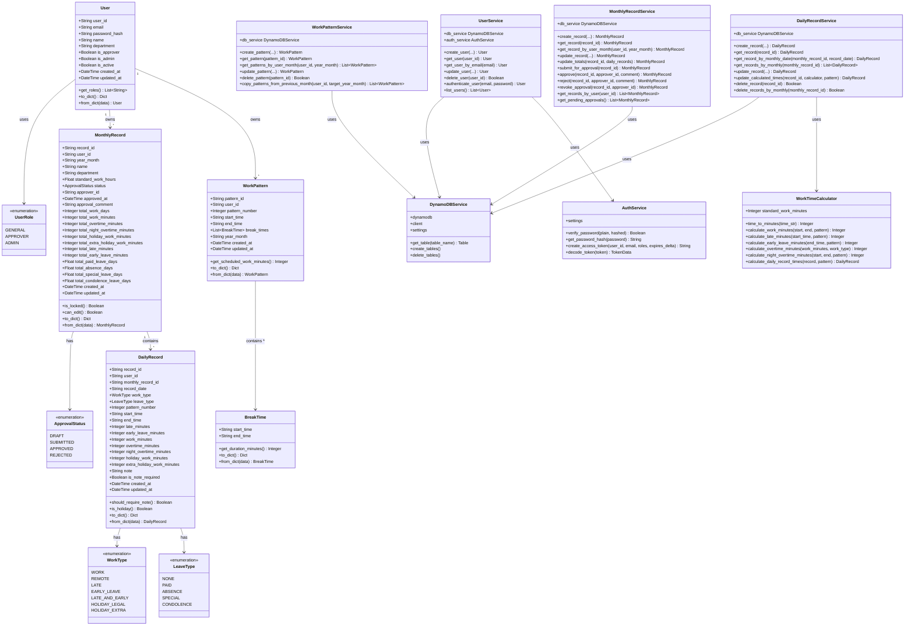

# クラス図

勤務月報システムのクラス構造を示します。

## バックエンド クラス図

```mermaid
classDiagram
    %% モデルクラス
    class User {
        +String user_id
        +String email
        +String password_hash
        +String name
        +String department
        +Boolean is_approver
        +Boolean is_admin
        +Boolean is_active
        +DateTime created_at
        +DateTime updated_at
        +get_roles() List~String~
        +to_dict() Dict
        +from_dict(data) User
    }

    class UserRole {
        <<enumeration>>
        GENERAL
        APPROVER
        ADMIN
    }

    class WorkPattern {
        +String pattern_id
        +String user_id
        +Integer pattern_number
        +String start_time
        +String end_time
        +List~BreakTime~ break_times
        +String year_month
        +DateTime created_at
        +DateTime updated_at
        +get_scheduled_work_minutes() Integer
        +to_dict() Dict
        +from_dict(data) WorkPattern
    }

    class BreakTime {
        +String start_time
        +String end_time
        +get_duration_minutes() Integer
        +to_dict() Dict
        +from_dict(data) BreakTime
    }

    class MonthlyRecord {
        +String record_id
        +String user_id
        +String year_month
        +String name
        +String department
        +Float standard_work_hours
        +ApprovalStatus status
        +String approver_id
        +DateTime approved_at
        +String approval_comment
        +Integer total_work_days
        +Integer total_work_minutes
        +Integer total_overtime_minutes
        +Integer total_night_overtime_minutes
        +Integer total_holiday_work_minutes
        +Integer total_extra_holiday_work_minutes
        +Integer total_late_minutes
        +Integer total_early_leave_minutes
        +Float total_paid_leave_days
        +Float total_absence_days
        +Float total_special_leave_days
        +Float total_condolence_leave_days
        +DateTime created_at
        +DateTime updated_at
        +is_locked() Boolean
        +can_edit() Boolean
        +to_dict() Dict
        +from_dict(data) MonthlyRecord
    }

    class ApprovalStatus {
        <<enumeration>>
        DRAFT
        SUBMITTED
        APPROVED
        REJECTED
    }

    class DailyRecord {
        +String record_id
        +String user_id
        +String monthly_record_id
        +String record_date
        +WorkType work_type
        +LeaveType leave_type
        +Integer pattern_number
        +String start_time
        +String end_time
        +Integer late_minutes
        +Integer early_leave_minutes
        +Integer work_minutes
        +Integer overtime_minutes
        +Integer night_overtime_minutes
        +Integer holiday_work_minutes
        +Integer extra_holiday_work_minutes
        +String note
        +Boolean is_note_required
        +DateTime created_at
        +DateTime updated_at
        +should_require_note() Boolean
        +is_holiday() Boolean
        +to_dict() Dict
        +from_dict(data) DailyRecord
    }

    class WorkType {
        <<enumeration>>
        WORK
        REMOTE
        LATE
        EARLY_LEAVE
        LATE_AND_EARLY
        HOLIDAY_LEGAL
        HOLIDAY_EXTRA
    }

    class LeaveType {
        <<enumeration>>
        NONE
        PAID
        ABSENCE
        SPECIAL
        CONDOLENCE
    }

    %% サービスクラス
    class DynamoDBService {
        +dynamodb
        +client
        +settings
        +get_table(table_name) Table
        +create_tables()
        +delete_tables()
    }

    class AuthService {
        +settings
        +verify_password(plain, hashed) Boolean
        +get_password_hash(password) String
        +create_access_token(user_id, email, roles, expires_delta) String
        +decode_token(token) TokenData
    }

    class UserService {
        +db_service DynamoDBService
        +auth_service AuthService
        +create_user(...) User
        +get_user(user_id) User
        +get_user_by_email(email) User
        +update_user(...) User
        +delete_user(user_id) Boolean
        +authenticate_user(email, password) User
        +list_users() List~User~
    }

    class WorkPatternService {
        +db_service DynamoDBService
        +create_pattern(...) WorkPattern
        +get_pattern(pattern_id) WorkPattern
        +get_patterns_by_user_month(user_id, year_month) List~WorkPattern~
        +update_pattern(...) WorkPattern
        +delete_pattern(pattern_id) Boolean
        +copy_patterns_from_previous_month(user_id, target_year_month) List~WorkPattern~
    }

    class MonthlyRecordService {
        +db_service DynamoDBService
        +create_record(...) MonthlyRecord
        +get_record(record_id) MonthlyRecord
        +get_record_by_user_month(user_id, year_month) MonthlyRecord
        +update_record(...) MonthlyRecord
        +update_totals(record_id, daily_records) MonthlyRecord
        +submit_for_approval(record_id) MonthlyRecord
        +approve(record_id, approver_id, comment) MonthlyRecord
        +reject(record_id, approver_id, comment) MonthlyRecord
        +revoke_approval(record_id, approver_id) MonthlyRecord
        +get_records_by_user(user_id) List~MonthlyRecord~
        +get_pending_approvals() List~MonthlyRecord~
    }

    class DailyRecordService {
        +db_service DynamoDBService
        +create_record(...) DailyRecord
        +get_record(record_id) DailyRecord
        +get_record_by_monthly_date(monthly_record_id, record_date) DailyRecord
        +get_records_by_monthly(monthly_record_id) List~DailyRecord~
        +update_record(...) DailyRecord
        +update_calculated_times(record_id, calculator, pattern) DailyRecord
        +delete_record(record_id) Boolean
        +delete_records_by_monthly(monthly_record_id) Boolean
    }

    class WorkTimeCalculator {
        +Integer standard_work_minutes
        +time_to_minutes(time_str) Integer
        +calculate_work_minutes(start, end, pattern) Integer
        +calculate_late_minutes(start_time, pattern) Integer
        +calculate_early_leave_minutes(end_time, pattern) Integer
        +calculate_overtime_minutes(work_minutes, work_type) Integer
        +calculate_night_overtime_minutes(start, end, pattern) Integer
        +calculate_daily_record_times(record, pattern) DailyRecord
    }

    %% リレーションシップ
    User --> UserRole : uses
    MonthlyRecord --> ApprovalStatus : has
    DailyRecord --> WorkType : has
    DailyRecord --> LeaveType : has
    WorkPattern --> BreakTime : contains *

    UserService --> DynamoDBService : uses
    UserService --> AuthService : uses
    WorkPatternService --> DynamoDBService : uses
    MonthlyRecordService --> DynamoDBService : uses
    DailyRecordService --> DynamoDBService : uses
    DailyRecordService --> WorkTimeCalculator : uses

    User "1" --> "*" MonthlyRecord : owns
    User "1" --> "*" WorkPattern : owns
    MonthlyRecord "1" --> "*" DailyRecord : contains
```

## フロントエンド クラス図

```mermaid
classDiagram
    %% ストア
    class AuthStore {
        +user Object
        +token String
        +loading Boolean
        +error String
        +isAuthenticated Boolean
        +isAdmin Boolean
        +isApprover Boolean
        +login(email, password) Boolean
        +logout()
        +fetchCurrentUser()
        +initialize()
    }

    %% APIサービス
    class AuthApi {
        +login(email, password) Token
        +getCurrentUser() User
    }

    class UsersApi {
        +list() List~User~
        +create(userData) User
        +get(userId) User
        +update(userId, userData) User
        +delete(userId)
    }

    class WorkPatternsApi {
        +list(yearMonth) List~WorkPattern~
        +create(patternData) WorkPattern
        +update(patternId, patternData) WorkPattern
        +delete(patternId)
        +copyFromPrevious(targetYearMonth) List~WorkPattern~
    }

    class MonthlyRecordsApi {
        +list() List~MonthlyRecord~
        +create(recordData) MonthlyRecord
        +get(recordId) MonthlyRecord
        +update(recordId, recordData) MonthlyRecord
        +listPending() List~MonthlyRecord~
        +approval(recordId, action, comment) MonthlyRecord
    }

    class DailyRecordsApi {
        +list(monthlyRecordId) List~DailyRecord~
        +create(monthlyRecordId, recordData) DailyRecord
        +get(recordId) DailyRecord
        +update(recordId, recordData) DailyRecord
        +delete(recordId)
    }

    %% ビューコンポーネント
    class LoginView {
        +email String
        +password String
        +handleLogin()
    }

    class MonthlyListView {
        +records List
        +loading Boolean
        +error String
        +showCreateModal Boolean
        +newRecord Object
        +fetchRecords()
        +createRecord()
        +submitRecord(record)
    }

    class DailyListView {
        +monthlyRecord Object
        +dailyRecords List
        +loading Boolean
        +error String
        +fetchData()
    }

    class DailyEditView {
        +formData Object
        +loading Boolean
        +saving Boolean
        +isEdit Boolean
        +isNoteRequired Boolean
        +fetchData()
        +saveRecord()
        +deleteRecord()
    }

    class UserManagementView {
        +users List
        +loading Boolean
        +showModal Boolean
        +formData Object
        +isEditMode Boolean
        +fetchUsers()
        +openCreateModal()
        +openEditModal(user)
        +saveUser()
    }

    class ApprovalListView {
        +records List
        +loading Boolean
        +showCommentModal Boolean
        +selectedRecord Object
        +isApproving Boolean
        +comment String
        +fetchRecords()
        +approveRecord(record)
        +rejectRecord(record)
        +submitAction()
    }

    %% リレーションシップ
    LoginView --> AuthStore : uses
    LoginView --> AuthApi : uses

    MonthlyListView --> AuthStore : uses
    MonthlyListView --> MonthlyRecordsApi : uses

    DailyListView --> MonthlyRecordsApi : uses
    DailyListView --> DailyRecordsApi : uses

    DailyEditView --> DailyRecordsApi : uses

    UserManagementView --> UsersApi : uses

    ApprovalListView --> MonthlyRecordsApi : uses
```
