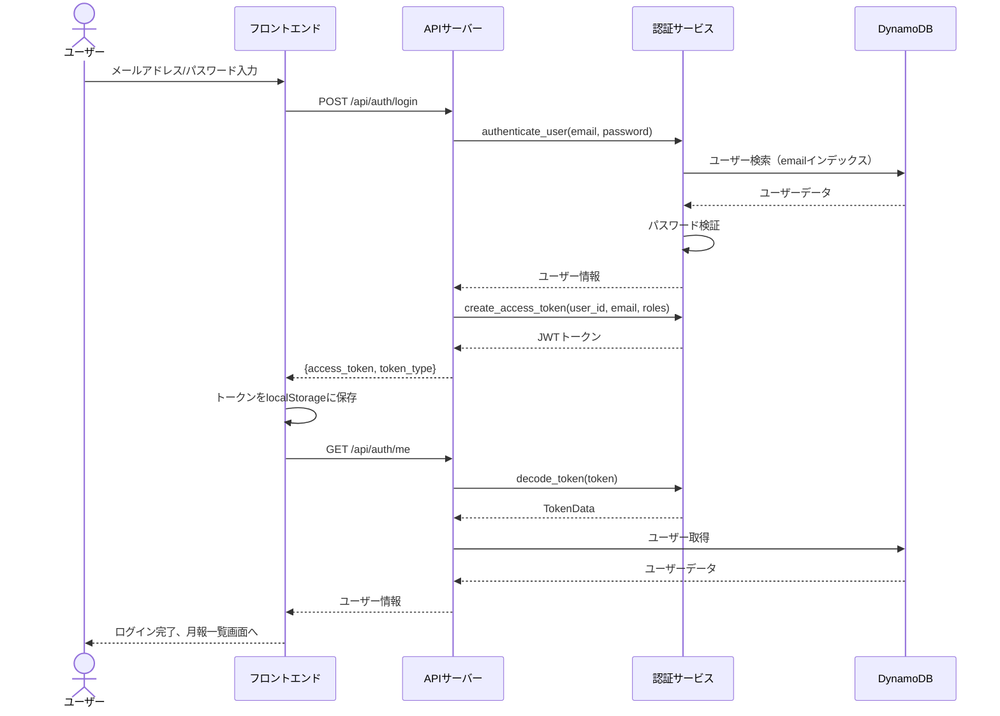
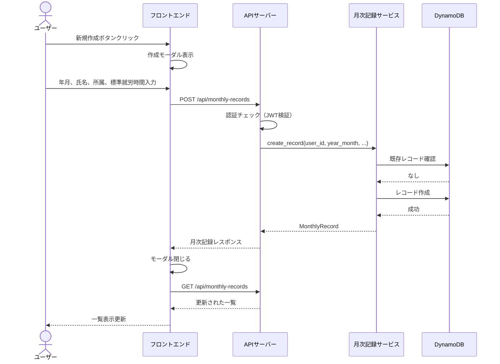
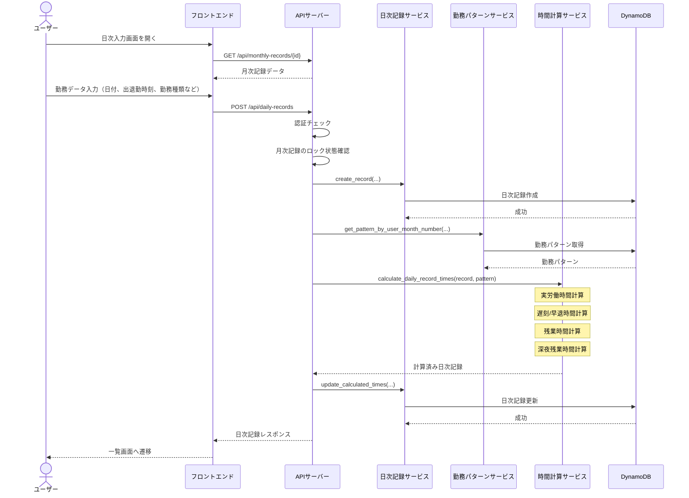
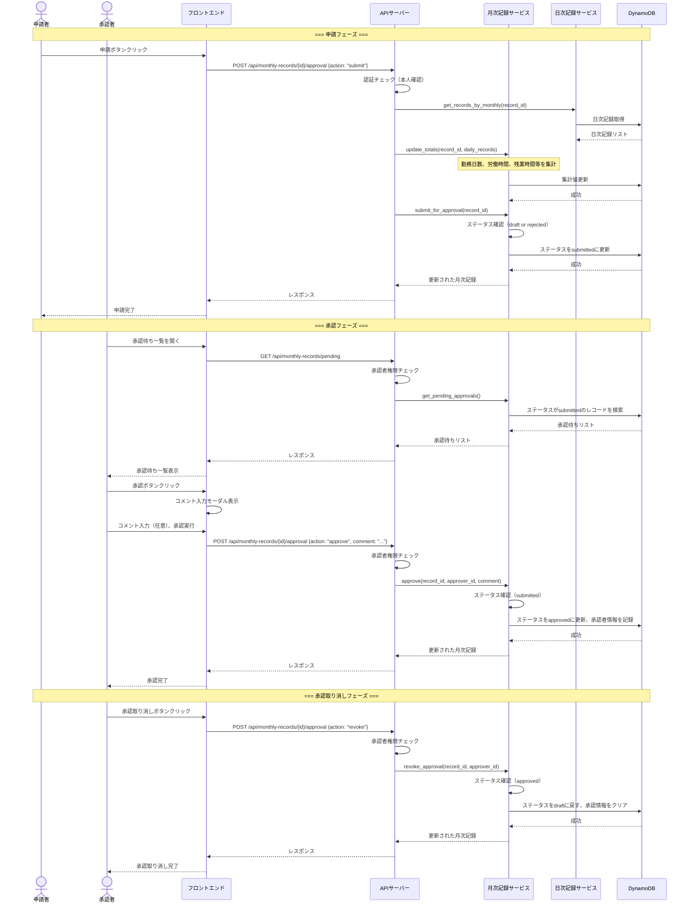
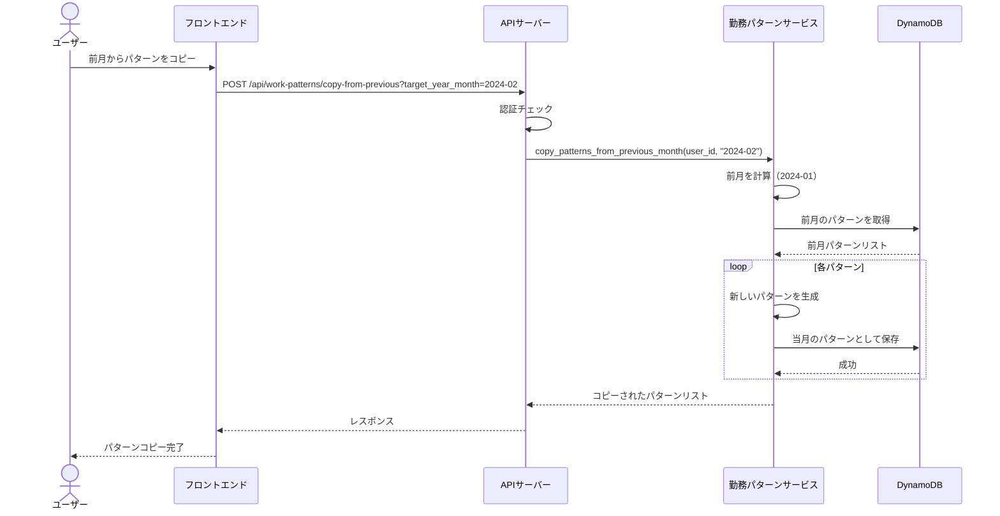
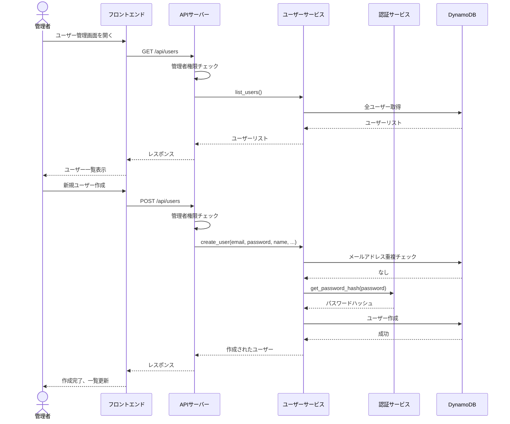

# シーケンス図

勤務月報システムの主要な処理フローを示します。

## 1. ログインシーケンス

```mermaid
sequenceDiagram
    actor User as ユーザー
    participant FE as フロントエンド
    participant API as APIサーバー
    participant Auth as 認証サービス
    participant DB as DynamoDB

    User->>FE: メールアドレス/パスワード入力
    FE->>API: POST /api/auth/login
    API->>Auth: authenticate_user(email, password)
    Auth->>DB: ユーザー検索（emailインデックス）
    DB-->>Auth: ユーザーデータ
    Auth->>Auth: パスワード検証
    Auth-->>API: ユーザー情報
    API->>Auth: create_access_token(user_id, email, roles)
    Auth-->>API: JWTトークン
    API-->>FE: {access_token, token_type}
    FE->>FE: トークンをlocalStorageに保存
    FE->>API: GET /api/auth/me
    API->>Auth: decode_token(token)
    Auth-->>API: TokenData
    API->>DB: ユーザー取得
    DB-->>API: ユーザーデータ
    API-->>FE: ユーザー情報
    FE-->>User: ログイン完了、月報一覧画面へ
```

## 2. 月次記録作成シーケンス

```mermaid
sequenceDiagram
    actor User as ユーザー
    participant FE as フロントエンド
    participant API as APIサーバー
    participant Monthly as 月次記録サービス
    participant DB as DynamoDB

    User->>FE: 新規作成ボタンクリック
    FE->>FE: 作成モーダル表示
    User->>FE: 年月、氏名、所属、標準就労時間入力
    FE->>API: POST /api/monthly-records
    API->>API: 認証チェック（JWT検証）
    API->>Monthly: create_record(user_id, year_month, ...)
    Monthly->>DB: 既存レコード確認
    DB-->>Monthly: なし
    Monthly->>DB: レコード作成
    DB-->>Monthly: 成功
    Monthly-->>API: MonthlyRecord
    API-->>FE: 月次記録レスポンス
    FE->>FE: モーダル閉じる
    FE->>API: GET /api/monthly-records
    API-->>FE: 更新された一覧
    FE-->>User: 一覧表示更新
```

## 3. 日次記録入力シーケンス

```mermaid
sequenceDiagram
    actor User as ユーザー
    participant FE as フロントエンド
    participant API as APIサーバー
    participant Daily as 日次記録サービス
    participant Pattern as 勤務パターンサービス
    participant Calc as 時間計算サービス
    participant DB as DynamoDB

    User->>FE: 日次入力画面を開く
    FE->>API: GET /api/monthly-records/{id}
    API-->>FE: 月次記録データ

    User->>FE: 勤務データ入力（日付、出退勤時刻、勤務種類など）
    FE->>API: POST /api/daily-records
    API->>API: 認証チェック
    API->>API: 月次記録のロック状態確認

    API->>Daily: create_record(...)
    Daily->>DB: 日次記録作成
    DB-->>Daily: 成功

    API->>Pattern: get_pattern_by_user_month_number(...)
    Pattern->>DB: 勤務パターン取得
    DB-->>Pattern: 勤務パターン

    API->>Calc: calculate_daily_record_times(record, pattern)
    Note over Calc: 実労働時間計算
    Note over Calc: 遅刻/早退時間計算
    Note over Calc: 残業時間計算
    Note over Calc: 深夜残業時間計算
    Calc-->>API: 計算済み日次記録

    API->>Daily: update_calculated_times(...)
    Daily->>DB: 日次記録更新
    DB-->>Daily: 成功

    API-->>FE: 日次記録レスポンス
    FE-->>User: 一覧画面へ遷移
```

## 4. 承認ワークフローシーケンス

```mermaid
sequenceDiagram
    actor Submitter as 申請者
    actor Approver as 承認者
    participant FE as フロントエンド
    participant API as APIサーバー
    participant Monthly as 月次記録サービス
    participant Daily as 日次記録サービス
    participant DB as DynamoDB

    Note over Submitter,DB: === 申請フェーズ ===

    Submitter->>FE: 申請ボタンクリック
    FE->>API: POST /api/monthly-records/{id}/approval {action: "submit"}
    API->>API: 認証チェック（本人確認）

    API->>Daily: get_records_by_monthly(record_id)
    Daily->>DB: 日次記録取得
    DB-->>Daily: 日次記録リスト
    
    API->>Monthly: update_totals(record_id, daily_records)
    Note over Monthly: 勤務日数、労働時間、残業時間等を集計
    Monthly->>DB: 集計値更新
    DB-->>Monthly: 成功

    API->>Monthly: submit_for_approval(record_id)
    Monthly->>Monthly: ステータス確認（draft or rejected）
    Monthly->>DB: ステータスをsubmittedに更新
    DB-->>Monthly: 成功
    Monthly-->>API: 更新された月次記録
    API-->>FE: レスポンス
    FE-->>Submitter: 申請完了

    Note over Submitter,DB: === 承認フェーズ ===

    Approver->>FE: 承認待ち一覧を開く
    FE->>API: GET /api/monthly-records/pending
    API->>API: 承認者権限チェック
    API->>Monthly: get_pending_approvals()
    Monthly->>DB: ステータスがsubmittedのレコードを検索
    DB-->>Monthly: 承認待ちリスト
    Monthly-->>API: 承認待ちリスト
    API-->>FE: レスポンス
    FE-->>Approver: 承認待ち一覧表示

    Approver->>FE: 承認ボタンクリック
    FE->>FE: コメント入力モーダル表示
    Approver->>FE: コメント入力（任意）、承認実行
    FE->>API: POST /api/monthly-records/{id}/approval {action: "approve", comment: "..."}
    API->>API: 承認者権限チェック
    API->>Monthly: approve(record_id, approver_id, comment)
    Monthly->>Monthly: ステータス確認（submitted）
    Monthly->>DB: ステータスをapprovedに更新、承認者情報を記録
    DB-->>Monthly: 成功
    Monthly-->>API: 更新された月次記録
    API-->>FE: レスポンス
    FE-->>Approver: 承認完了

    Note over Submitter,DB: === 承認取り消しフェーズ ===

    Approver->>FE: 承認取り消しボタンクリック
    FE->>API: POST /api/monthly-records/{id}/approval {action: "revoke"}
    API->>API: 承認者権限チェック
    API->>Monthly: revoke_approval(record_id, approver_id)
    Monthly->>Monthly: ステータス確認（approved）
    Monthly->>DB: ステータスをdraftに戻す、承認情報をクリア
    DB-->>Monthly: 成功
    Monthly-->>API: 更新された月次記録
    API-->>FE: レスポンス
    FE-->>Approver: 承認取り消し完了
```

## 5. 勤務パターン継承シーケンス

```mermaid
sequenceDiagram
    actor User as ユーザー
    participant FE as フロントエンド
    participant API as APIサーバー
    participant Pattern as 勤務パターンサービス
    participant DB as DynamoDB

    User->>FE: 前月からパターンをコピー
    FE->>API: POST /api/work-patterns/copy-from-previous?target_year_month=2024-02
    API->>API: 認証チェック

    API->>Pattern: copy_patterns_from_previous_month(user_id, "2024-02")
    Pattern->>Pattern: 前月を計算（2024-01）
    Pattern->>DB: 前月のパターンを取得
    DB-->>Pattern: 前月パターンリスト

    loop 各パターン
        Pattern->>Pattern: 新しいパターンを生成
        Pattern->>DB: 当月のパターンとして保存
        DB-->>Pattern: 成功
    end

    Pattern-->>API: コピーされたパターンリスト
    API-->>FE: レスポンス
    FE-->>User: パターンコピー完了
```

## 6. ユーザー管理シーケンス

```mermaid
sequenceDiagram
    actor Admin as 管理者
    participant FE as フロントエンド
    participant API as APIサーバー
    participant UserSvc as ユーザーサービス
    participant Auth as 認証サービス
    participant DB as DynamoDB

    Admin->>FE: ユーザー管理画面を開く
    FE->>API: GET /api/users
    API->>API: 管理者権限チェック
    API->>UserSvc: list_users()
    UserSvc->>DB: 全ユーザー取得
    DB-->>UserSvc: ユーザーリスト
    UserSvc-->>API: ユーザーリスト
    API-->>FE: レスポンス
    FE-->>Admin: ユーザー一覧表示

    Admin->>FE: 新規ユーザー作成
    FE->>API: POST /api/users
    API->>API: 管理者権限チェック
    API->>UserSvc: create_user(email, password, name, ...)
    UserSvc->>DB: メールアドレス重複チェック
    DB-->>UserSvc: なし
    UserSvc->>Auth: get_password_hash(password)
    Auth-->>UserSvc: パスワードハッシュ
    UserSvc->>DB: ユーザー作成
    DB-->>UserSvc: 成功
    UserSvc-->>API: 作成されたユーザー
    API-->>FE: レスポンス
    FE-->>Admin: 作成完了、一覧更新
```
