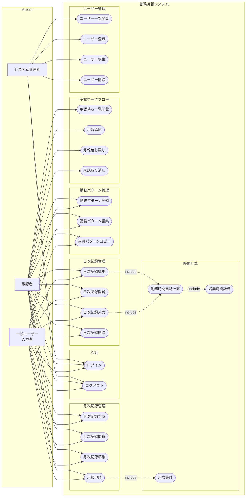
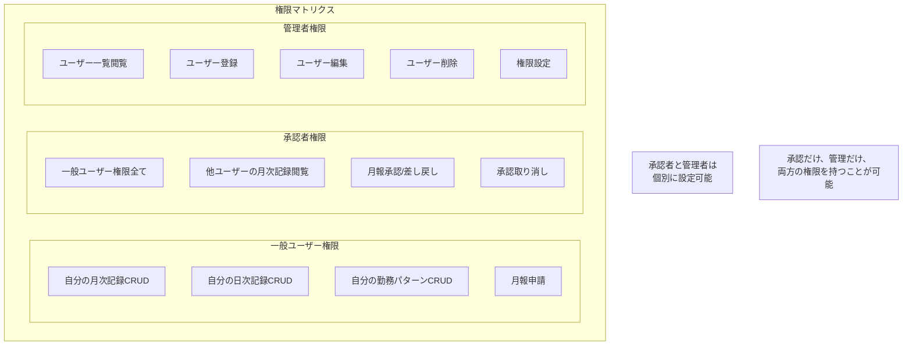
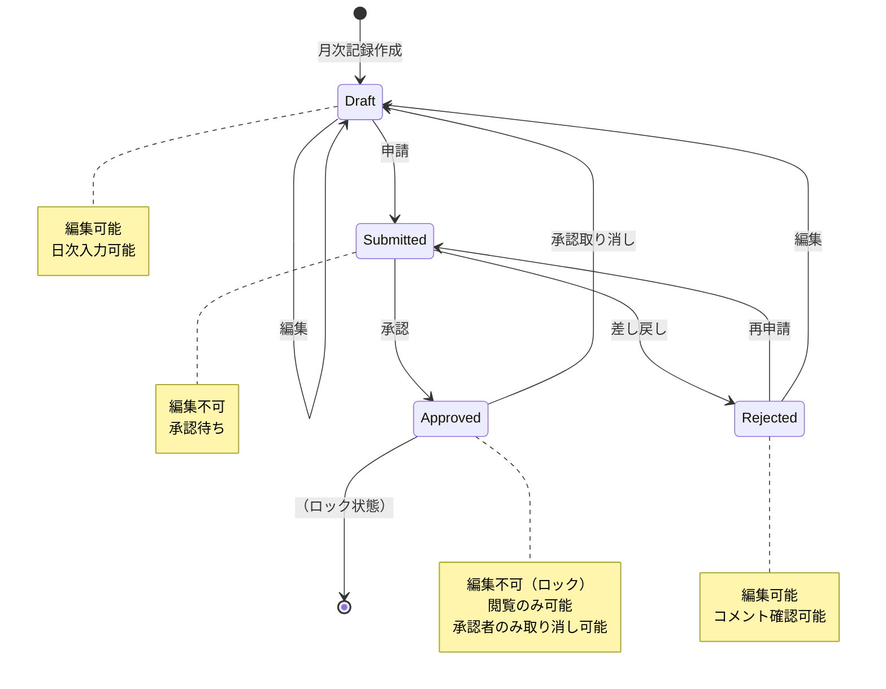

# ユースケース図

勤務月報システムのユースケースを示します。

## システム全体のユースケース図

## 詳細ユースケース説明

### 認証関連

| ユースケース | アクター | 説明 |
|------------|---------|------|
| UC1: ログイン | 全ユーザー | メールアドレスとパスワードでシステムにログイン |
| UC2: ログアウト | 全ユーザー | システムからログアウト |

### 月次記録管理

| ユースケース | アクター | 説明 |
|------------|---------|------|
| UC3: 月次記録作成 | 一般、承認者 | 新規月次記録を作成。氏名、所属、標準就労時間を設定 |
| UC4: 月次記録閲覧 | 一般、承認者 | 自分の月次記録を閲覧。承認者は他ユーザーの記録も閲覧可能 |
| UC5: 月次記録編集 | 一般、承認者 | 月次記録の基本情報を編集。承認済みは編集不可 |
| UC6: 月報申請 | 一般、承認者 | 月報を承認者に申請。申請時に集計が実行される |

### 日次記録管理

| ユースケース | アクター | 説明 |
|------------|---------|------|
| UC7: 日次記録入力 | 一般、承認者 | 日ごとの勤務データを入力。時間は自動計算される |
| UC8: 日次記録閲覧 | 一般、承認者 | 日次記録の詳細を閲覧 |
| UC9: 日次記録編集 | 一般、承認者 | 日次記録を編集。計算値の手動上書きも可能 |
| UC10: 日次記録削除 | 一般、承認者 | 日次記録を削除 |

### 勤務パターン管理

| ユースケース | アクター | 説明 |
|------------|---------|------|
| UC11: 勤務パターン登録 | 一般、承認者 | 始業/終業時刻、休憩時間を設定。最大3パターンまで |
| UC12: 勤務パターン編集 | 一般、承認者 | 既存パターンの時間を変更 |
| UC13: 前月パターンコピー | 一般、承認者 | 前月のパターンを当月にコピー |

### 承認ワークフロー

| ユースケース | アクター | 説明 |
|------------|---------|------|
| UC14: 承認待ち一覧閲覧 | 承認者 | 承認待ちの月報一覧を表示 |
| UC15: 月報承認 | 承認者 | 月報を承認。承認後はデータがロック |
| UC16: 月報差し戻し | 承認者 | 月報を差し戻し。コメント付与可能 |
| UC17: 承認取り消し | 承認者 | 承認済み月報の承認を取り消し |

### ユーザー管理

| ユースケース | アクター | 説明 |
|------------|---------|------|
| UC18: ユーザー一覧閲覧 | 管理者 | 全ユーザーの一覧を表示 |
| UC19: ユーザー登録 | 管理者 | 新規ユーザーを作成。権限を設定 |
| UC20: ユーザー編集 | 管理者 | ユーザー情報、権限を変更 |
| UC21: ユーザー削除 | 管理者 | ユーザーを削除 |

### 時間計算（システム内部）

| ユースケース | 説明 |
|------------|------|
| UC22: 勤務時間自動計算 | 出退勤時刻から実労働時間を計算。休憩時間を減算 |
| UC23: 残業時間計算 | 標準就労時間を超えた時間を残業として計算。深夜、休日残業を分類 |
| UC24: 月次集計 | 日次記録から月間の勤務日数、労働時間、残業時間等を集計 |

## 権限マトリクス

## ステート遷移図（月次記録）

